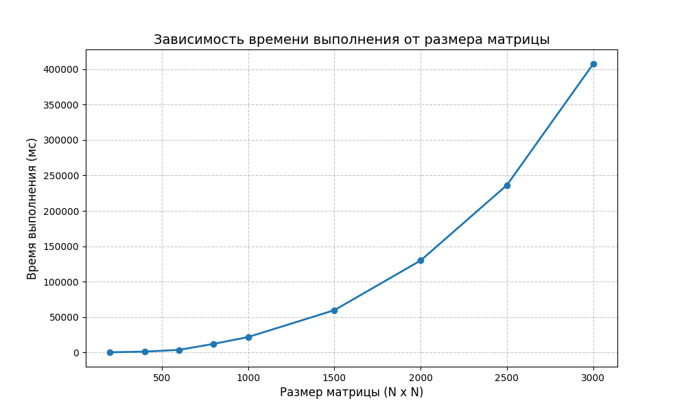

# Лабораторная работа 1
Мной была написана программа на C++, которая считывает квадратные матрицы из файлов, перемножает их, сохраняет результат и возвращает затраченное время через стандартный поток вывода. Скрипт `main.py` отвечает за генерацию матриц, работу с директориями, запуск программы на C++, вывод её результатов работы и визуализацию.
# Запуск программы
Ввести `python3 main.py` в терминал, рядом с main.py должен находиться config.json.
# Результаты исследования
Запуск программы при исследовании производился с конфигом, устанавливающим размеры матриц в 200, 400, 600, 800, 1000, 1500, 2000, 2500, 3000 элементов. Результат запусков приведён в таблице ниже 
| Размер матрицы  | Время работы (мс) |
| ------------- | ------------- |
| 200  | 119  |
| 400  | 970  |
| 600  | 3483  |
| 800  | 11937  |
| 1000  | 21563  |
| 1500  | 59564  |
| 2000  | 129776  |
| 2500  | 236354  |
| 3000  | 407684  |

Визуализация данных таблицы:

# Вывод
Последовательная программа работает неприемлемо долго.
