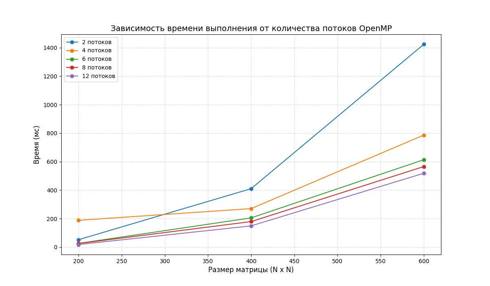

# Лабораторная работа 2
Программа на C++ была модифицирована добавлением технологии OpenMP. Было произведено исследование зависимости времени выполнения от количества задействованных потоков и размеров матриц.
# Запуск программы
Ввести `python3 main.py` в терминал, рядом с main.py должен находиться config.json.
# Результаты исследования
Используемый для исследований процессор - `AMD Ryzen 5 5600H` (6 ядер, 12 потоков, базовая частота 3.3 ГГц. Кэш L1 384 КБ, L2 3 МБ, L3 16 МБ).
Запуск программы при исследовании производился с конфигом, устанавливающим размеры матриц в 200, 400, 600, 800, 1000, 1500, 2000, 2500, 3000, 5000 элементов. Количество потоков при этом изменялось от 1 до 12 (1, 2, 4, 8, 12). Результат запусков приведён в таблице ниже. 
| Размер матрицы  | 1 поток (данные из прошлой л/р) | 2 потока | 4 потока | 6 потоков | 8 потоков |12 потоков |
| ------------- | ------------- | ------------- | ------------- | ------------- | ------------- |------------- |
| 200  | 119  | 51 | 29 | 27 | 25 | 17 |
| 400  | 970  | 406 | 216 | 146 | 181 | 133 |
| 600  | 3483  | 1431 | 695 | 516 | 561 | 449 |
| 800  | 11937  | 3250 | 1741 | 1210 | 1259 | 1059 |
| 1000  | 21563  | 6367 | 3178 | 2269 | 2449 | 2057 |
| 1500  | 59564  | 21349 | 10777 | 8048 | 8575 | 7014 |
| 2000  | 129776  | 50671 | 27449 | 19449 | 18273 | 16563 |
| 2500  | 236354  | 99239 | 50549 | 35197 | 34339 | 32293 |
| 3000  | 407684  | 171020 | 88917 | 60257 | 74191 | 57836 |
| 5000  | X  | 789442  | 398574 | 280360 | 273029 | 257124 |

Визуализация данных таблицы:

# Вывод
Использование параллелизма позволило кратно ускорить программу. В среднем использование 12 потоков уменьшает время работы программмы в 7,4 раза.
Примечательно, что использование более чем 6 потоков не привносит значительного вклада. В среднем использование 12 потоков по сравнению с 6 ускоряет выполнение лишь на 8%. Это означает, что виртуальные ядра процессора незначительно улучшают производительность в этой задаче.
